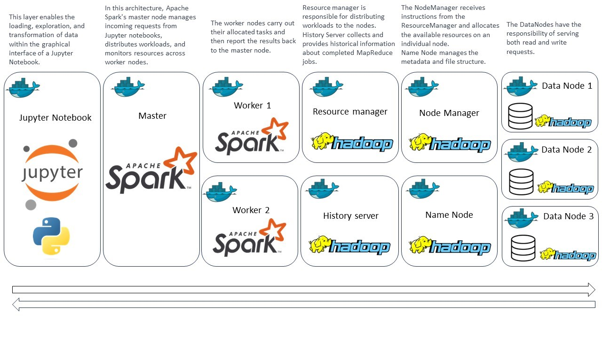

# Labels

- Google Cloud Platform (GCP)
- Docker (Containerization)
- Hadoop Distributed File System (HDFS)
- Apache Spark
- Virtual Machines
- Big Data Analysis
- Machine Learning

# IoT Botnet Attack Analysis

## Author

**Marcos Augusto Burgos Saavedra**

## Introduction

### Project Overview

In the digital age, the Internet of Things (IoT) has experienced significant growth, connecting billions of devices across various applications, from smart homes to critical infrastructure. However, this expansion has also introduced new security threats, particularly malware attacks. IoT devices are highly vulnerable to malware such as **BASHLITE** and **Mirai**, which transform them into botnets controlled by cybercriminals. These botnets are then used for **DDoS attacks, data theft, and malware dissemination**.

This project focuses on **cybersecurity in IoT devices**, specifically analyzing real network traffic data.

### Motivation

The impact of these attacks extends beyond individual users, affecting the infrastructure that relies on IoT technology. **Protecting these devices and their networks is essential** to ensuring cybersecurity.

To address this challenge, researchers have developed the **N-BaIoT dataset**, which contains real traffic data from **nine IoT devices** infected by Mirai and BASHLITE malware. This dataset serves as a valuable resource for developing **intrusion detection** and **classification methods**.

### Objectives and Features

This project aims to apply **Machine Learning** techniques to detect and classify IoT botnet attacks using the **N-BaIoT dataset**. The key tasks include:

- **1. Anomaly Detection:** Identify abnormal traffic patterns and distinguish between normal and malicious network traffic.
- **2/3. Multi-Class Classification:** Classify IoT network traffic into three-class and eleven-class categories, differentiating between benign and malicious traffic at varying levels of granularity.
- **4. Clustering:** Uncover hidden patterns in the data to enhance our understanding of IoT botnet behavior.

## Limitations of Traditional Computing

Traditional computing struggles with the challenges of this project due to:

- **Large Dataset Size:** 600,000 records (~12GB of data)
- **Scalability Issues:** High computational requirements for real-time detection and classification
- **Performance Bottlenecks:** Limited processing power for handling big data efficiently

## Cloud Computing Benefits

To overcome these limitations, cloud computing is leveraged for its **scalability, performance, and flexibility**. The cloud-based infrastructure enables efficient processing, analysis, and machine learning model training while minimizing the complexity of infrastructure management.

## Technical Solutions

### Cloud Technologies Used

The project utilizes the following cloud-based technologies:

1. **Virtual Machines (VMs):** Deploying the project in the cloud for a scalable and flexible computing environment.
2. **Firewall:** Enhancing security by securing access to HDFS, Spark, and Jupyter environments.
3. **Docker (Containerization):** Isolating components using **Docker** and **Docker Compose** to manage **HDFS, Spark, and Jupyter environments**.
4. **Hadoop Distributed File System (HDFS):** Managing large-scale storage with redundancy and fault tolerance.
5. **Apache Spark:** High-performance distributed computing for processing and analyzing large datasets.
6. **Jupyter Notebook:** Interactive cloud-based coding environment for analysis and documentation.

### Cloud Cost Estimation

- **Region:** Australia-southeast1 (Sydney) / Australia-southeast1-b
- **Machine Configuration:** N1 (balanced price-performance)
- **Machine Type:** 2 vCPUs + 7.5 GB memory
- **OS:** Ubuntu
- **Disk Size:** 50GB (Current data: ~26.91GB in HDFS)
- **Estimated Monthly Cost:** **$75.63 USD**
- **Hourly Cost:** **$0.10 USD/hour** (VM is turned on only when needed)

## Architecture Design

The following diagram illustrates the project workflow:



## Installation and Usage

### Setup Instructions

1. Clone this repository:
   ```sh
   git clone https://github.com/BurgosSaavedra/IoT-Botnet-Attack-Analysis.git
   cd your-repository
   ```
2. Build and run the Docker containers:
   ```sh
   docker-compose up -d
   ```
3. Access Jupyter Notebook:
   ```sh
   http://localhost:8888/
   ```
4. Run analysis scripts inside Jupyter.

## Results

The conclusive findings indicated that achieving a high degree of accuracy in distinguishing benign from malicious traffic proved to be unattainable. This conclusion was substantiated through the application of binary regression, random forest decision trees, and the Multilayer Perceptron Classifier.

Furthermore, our clustering analysis unveiled the presence of three distinct data clusters. In future research pursuits, I recommend conducting an in-depth exploration of this approach to gain a better understanding of the unique characteristics of each cluster. This exploration aims to help us determine whether there are significant distinctions between benign traffic, BASHLITE, and Mirai data.

## Contact

For any inquiries, please contact **Marcos Augusto Burgos Saavedra** at [burgossaavedra.marcos@gmail.com](mailto:your.email@example.com).
